# Real-Time Smart Security Access Control System 🔐

> 🎯 A facial recognition-based access control system powered by Python, OpenCV, and Firebase.

## 📑 Table of Contents

- [Project Purpose](#project-purpose)
- [Scope](#scope)
- [System Architecture](#system-architecture)
- [Technologies Used](#technologies-used)
- [Firebase Integration](#firebase-integration)
- [Real-Time Monitoring](#real-time-monitoring)
- [GUI Overview](#gui-overview)
- [Use Cases](#use-cases)
- [Results](#results)
- [How to Run](#how-to-run)
- [File Structure](#file-structure)
- [Future Improvements](#future-improvements)
- [License](#license)
- [Languages 🌐](#languages-)

---

## 🧠 Project Purpose

The primary goal of this project is to enhance and automate security control mechanisms using real-time face recognition technology. The system captures users' faces via a webcam, processes the encodings, and compares them against a Firebase database. Upon match, it authorizes access while displaying identity information such as name, profession, and department. Entry counts and logs are updated and displayed in real time.

## 📌 Scope

- **Face Recognition Technology:** Utilizes OpenCV for image capture and processing. The `face_recognition` library encodes facial data, compares it against stored records, and determines match status.
- **Firebase Database:** Stores users' metadata (ID, profession, department, entry logs). Each recognition event updates the Firebase database in real-time.
- **Real-Time Monitoring:** Displays user information in a custom OpenCV panel, including entry count and user metadata pulled from Firebase.
- **UI Development:** A GUI developed with Tkinter simplifies user interaction. The live feed and identification panel enhance usability.
- **Application Areas:** Offices, companies, schools—anywhere that requires access control. It can also complement other systems.

## 🏗️ System Architecture

```mermaid
flowchart TD
    A[Camera] -->|Capture Frame| B(main.py)
    B -->|Yüz Kodlama| C{face_recognition}
    C -->|Compare| D[(Firebase DB)]
    D -->|Get User Info| B
    B -->|Display Info| E[OpenCV GUI]
```



## 🛠️ Technologies Used

- Python
- OpenCV
- face_recognition
- Firebase (Authentication, Realtime Database, Storage)
- cryptography
- Tkinter

## 🔌 Firebase Integration

This system uses Firebase for user data storage, authentication, and real-time updates. On every face match event, Firebase is queried for user metadata and updated with the latest entry statistics.

## 📡 Real-Time Monitoring

Each successful face match updates entry logs and user information on-screen using OpenCV, in real-time. The Firebase connection ensures that all changes reflect immediately across the system.

## 🖥️ GUI Overview

- Live camera stream
- Real-time user info panel
- Admin interaction via Tkinter

## 🌍 Use Cases

- Office buildings
- Schools and universities
- High-security zones

## ✅ Results

The project demonstrates high accuracy and real-time performance by combining AI and computer vision. Its secure integration with Firebase enhances both usability and data integrity. The system meets modern access control needs with encryption and cloud-based architecture.

## ▶️ How to Run

```bash
git clone https://github.com/yourusername/projectname.git
cd projectname
pip install -r requirements.txt
python main.py
```

## 📁 File Structure

```
project/
├── EncodeGeneration.py
├── AddDataToDatabase.py
├── ManageUser.py
├── main.py
├── requirements.txt
└── README.md
```

## 🔮 Future Improvements

- Multi-camera support
- Enhanced spoof detection
- Admin dashboard via browser

## 📜 License

This project is licensed under the MIT License - see the [LICENSE](LICENSE) file for details.

## 🌐 Languages

- 🇬🇧 English
- 🇹🇷 Türkçe versiyonu README altına eklenebilir.
